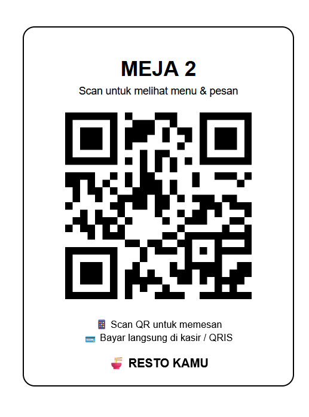
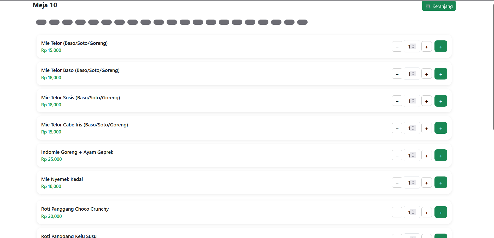
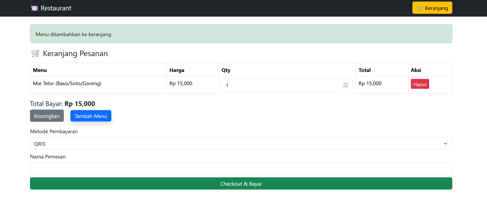
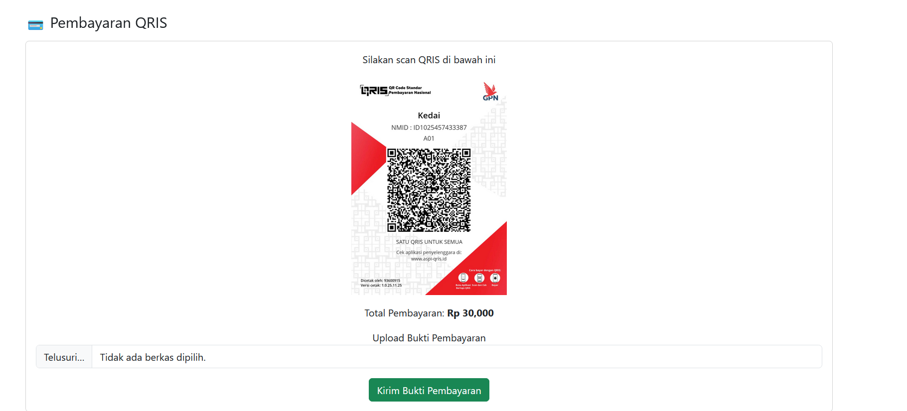
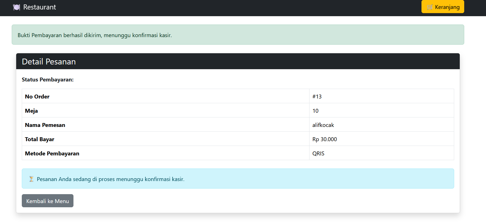

Link Jurnal untuk project Ini:

https://docs.google.com/document/d/1WJGyrHK3yp3kVQJayof8wbn2lJwLRe4Z/edit?usp=drivesdk&ouid=114875993941243424526&rtpof=true&sd=true

# 🍽️ Restaurant QR Order System

Sistem **Restaurant QR Order** adalah aplikasi berbasis web yang memungkinkan pelanggan melakukan pemesanan makanan dan minuman dengan cara **scan QR Code** langsung dari meja tanpa perlu aplikasi tambahan.  
Sistem ini dirancang untuk meningkatkan efisiensi pelayanan, mengurangi antrian, dan mempermudah pengelolaan pesanan restoran.

---

## ✨ Fitur Utama

### 👤 Pelanggan
- Scan QR Code meja
- Melihat daftar menu
- Menambahkan menu ke keranjang
- Melakukan pemesanan secara langsung
- Melihat status pesanan

## 🛠️ Teknologi yang Digunakan

- **Backend**: Laravel / PHP Native  
- **Frontend**: HTML, CSS, JavaScript, Bootstrap  
- **Database**: MySQL  
- **QR Code**: Library QR Code Generator  
- **Server**: Apache (Laragon)

## 📸 Screenshot Aplikasi

### Scan QR Code

### Halaman Menu Pelanggan

### Halaman Keranjang

### Halaman Pembayaran Qris

### Halaman Konfirmasi Pesanan

